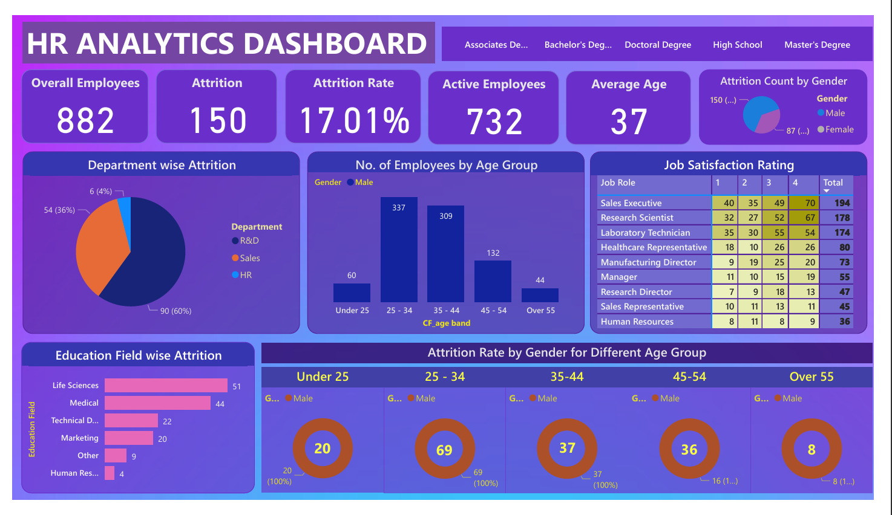

# HR Analytics Dashboard using Power BI

## Objective

The objective of this project is to identify the key factors driving employee attrition and provide actionable insights for improving workforce retention in an organization.

This dashboard provides insights into employee attrition which helps the HR team for further analysis.

Throughout this project:

* HR data was analyzed to uncover valuable insights.
* Interactive dashboards were developed to visualize key HR metrics.
* Data-driven insights were generated to support decision-making.

## Steps Followed

**1. Data Gathering:**

* Importing raw data CSV file into Power BI and transforming it in Power Query Editor for cleaning and data processing.

**2. Data Cleaning:**

* Cleaning was performed by removing empty columns, duplicates, and errors.
* Replacing values with appropriate naming conventions.
* Detecting data types of every column using Power Query Editor.

**3. Data Processing:**

* Created a new column called **AttritionCount** using conditional logic.
* This column was used for creating KPIs and charts.
* Created Attrition Rate using DAX measures.

**4. Data Analysis:**

* Analysis includes the creation of various visualizations such as bar charts, KPI cards, table charts, pie charts, and other visual reports.
* These visualizations help present insights in an understandable and interactive format.

### Key Questions of the Dashboard

* What is the Total Employee Count?
* What is the employee's Average Age and Average Salary?
* What is the Attrition Count of men and women?
* What are employees' working years at the company?
* Which department has the maximum employees?
* What is the gender distribution?
* Which education field has the maximum employees?
* Which business travel category has the maximum employees?

### Learned About

1. Calculated Fields to calculate Attrition Rate and Active Employees.
2. Matrix Table for displaying Job Satisfaction ratings.
3. Donut Chart and Pie Chart.
4. Bar Chart and Cluster Chart.
5. KPI (Key Performance Indicators) and Slicers.
6. Filters for analyzing different education fields.

### Key Insights Summary

1. **Total Employees:** The organization currently employs 1470 individuals.
2. **Attrition Analysis:** A total of 237 employees left the organization, including 150 males and 87 females.
3. **Departmental Attrition:** The Research and Development department experienced the highest attrition rate.
4. **Education Field Impact:** Employees in the Life Sciences field had the highest attrition rate.
5. **Job Role Affected:** Sales roles experienced the highest attrition rate.
6. **Education-wise Attrition:** High School education level showed the highest attrition percentage.
7. **Attrition by Age Group:** The age group of 25–34 years recorded the highest attrition count.

## Dashboard

# 👩‍💻 Author

**Rashmi Kamal**

📧 [rashmikamal2000@gmail.com](mailto:rashmikamal2000@gmail.com)

🔗 LinkedIn: https://www.linkedin.com/in/rashmi-kamal-6b9146240
